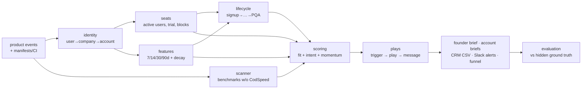

# gtm-signal-engine

**The Monday-morning pipeline machine for a product-led developer-tools company.**
It turns product usage and market signals into a ranked list of accounts, a play for
each one, and a one-page brief the founder can act on before standup.

It's modeled on [CodSpeed](https://codspeed.io) (continuous performance testing). It
knows the onboarding flow (GitHub App, Wizard, baseline, first PR report), the billing
rules (5 free active users, 14-day Pro trial, blocked users when auto-allocation is off,
600 free macro-runner minutes), the instruments (simulation, walltime, memory), and
how teams benchmark today in every language CodSpeed supports.

> [!IMPORTANT]
> **Independent demo.** This project is not affiliated with or endorsed by CodSpeed.
> All data is synthetic: fake companies from word lists on `.example` domains, invented
> names, no real people, companies or customers. **Every event name, weight and
> threshold is a hypothesis**, derived from CodSpeed's public docs (Oct 2026), not from
> CodSpeed internals.

## What it does



* **Ingests** product-usage events and market signals: synthetic by default, with
  documented JSONL/CSV import formats and one optional live GitHub adapter.
* **Resolves identity** with confidence scores: corporate domain (1.0), alias domain
  (0.95), GitHub org (0.9), freemail + org (0.8), commit-email domain (0.7), unresolved.
  Subsidiaries roll up to parent accounts and bots are excluded.
* **Tracks lifecycle**: signed up → installed → activated → engaged → PQL → PQA →
  opportunity, plus a churn-risk overlay. Every transition is stored in SQLite with history.
* **Scores** every account on fit and intent (0-100 each), with transparent rules in
  `config/signals.toml`, a 14-day recency half-life, negative signals, and week-over-week
  deltas.
* **Matches plays** from a 13-play library: trial ending, blocked users (founder at 2+, GTM engineer for one), security review,
  runner overage, multi-team spread, cap approaching, AI-native, walltime-only, churn
  risk, activation rescue, outbound, not addressable.
* **Estimates revenue** from documented pricing ($15/user/month annual, $20 monthly,
  Graviton $0.032/min after 600 free, Ryzen $0.06/min, Enterprise "custom").
* **Writes** a weekly founder brief, per-account briefs, CRM-ready CSVs (HubSpot and
  Salesforce mappings), Slack Block Kit alert payloads (never sent), a funnel report,
  and an evaluation report.
* **Evaluates itself** against hidden synthetic ground truth: precision@k, recall,
  lift vs random, hit rate per play.

## Quick start

Requires Python 3.12+ and [uv](https://docs.astral.sh/uv/). Runtime dependencies:
standard library only.

```bash
uv sync
uv run signal-engine demo        # generate + two consecutive weeks + evaluate (~3 s)
```

Other commands:

```bash
uv run signal-engine generate --companies 400 --users 5000 --events 150000 --seed 42 --db out/demo.db
uv run signal-engine ingest --db out/demo.db --events docs/examples/events.jsonl   # see docs/EVENT_SCHEMA.md
uv run signal-engine run --db out/demo.db --week 2026-10-12      # identity → scan → lifecycle → score → plays → outputs
uv run signal-engine brief --db out/demo.db                       # founder brief to stdout
uv run signal-engine evaluate --db out/demo.db
uv run signal-engine github-scan --org-list local/targets.txt     # OPTIONAL live adapter (gh CLI), writes to local/ only
```

Everything is deterministic: one seed (42) and a fixed "now" (`2026-10-12T09:00:00-07:00`)
drive the whole run, so the same seed gives byte-identical output files. The founder's
name, prices and every threshold live in `config/`, not in code.

## Signal framework

Full detail, including why each signal predicts revenue and how to tune it, is in
[docs/SIGNAL_FRAMEWORK.md](docs/SIGNAL_FRAMEWORK.md).

| Axis | Signal | Weight / points | Hypothesis |
|---|---|---|---|
| Fit | Engineering headcount band | 4-28 | Seats are the main revenue line |
| Fit | Language mix | up to 25 | Rust/C++/Python/Node run in simulation; Go/JVM are walltime-only, so they use paid runner minutes |
| Fit | Private-repo ratio | up to 15 | Public repos are free; private repos need seats |
| Fit | Industry, parent size, benchmarks without CodSpeed | up to 15 / 15 / 12 | Performance-sensitive and expandable accounts |
| Intent | baseline_created, first_pr_report | 6 each | Activation: PRs only get comparisons once a baseline exists |
| Intent | required_check_enabled | 8 | CodSpeed gates merges, so it sticks |
| Intent | regression_detected / acknowledged | 1 / 2 per (decayed) event | Value delivered and seen |
| Intent | @codspeedbot fix PRs merged, MCP connected | 4 / 5 | AI-native, expansion and case-study candidates |
| Intent | free_limit_exceeded, trial_started, user_blocked_no_seat | 6 / 6 / 3 | Billing pressure |
| Intent | soc2_report_requested, sso_page_view, trust_center_visit | 8 / 5 / 5 | Security review means an Enterprise deal is likely |
| Intent | over cap / near cap / blocked users / runner overage (derived) | 14 / 6 / 5 each / 10 | Seat and runner revenue right now |
| Intent | informational check, Wizard disabled, seats removed, ignored benchmarks, run drop | -8 / -6 / -4 / -1.5 / -8 | Churn precursors |
| Priority | 0.4 × fit + 0.6 × intent + momentum (0.3 × Δintent, ±10) | | Rewards accounts that are heating up |

## Play library

Details (who acts, what to say, success metrics) are in [docs/PLAYBOOK.md](docs/PLAYBOOK.md).

**Founder capacity.** `founder_weekly_capacity = 8` in `config/plays.toml`. Founder-owned
plays are ranked by play priority, then account priority. The top 8 stay with the founder,
and the rest are reassigned to the GTM engineer with the note "over founder capacity".
Thresholds are tuned so founder-eligible accounts are about 5-10% of active accounts
(29 of 302, 9.6%, in the demo).

| Priority | Play | Trigger | Owner (SLA) |
|---|---|---|---|
| 100 | Trial ending | Pro trial active, ≤ 5 days left | Founder (24h) |
| 95 | Blocked users | ≥ 2 users blocked without a seat | Founder (8h) |
| 92 | Single blocked user | exactly 1 user blocked without a seat | GTM engineer (8h, same day) |
| 90 | Security review | Trust Center / SOC 2 / SSO / security docs in 14 days | GTM engineer, then founder (24h) |
| 85 | Runner overage | Projected Graviton > 600 min, Ryzen requested, or budget set | GTM engineer (48h) |
| 80 | Multi-team spread | ≥ 2 GitHub orgs active in one parent account | GTM engineer, then founder (72h) |
| 75 | Cap approaching | 4-5 of 5 free seats and rising | GTM engineer (72h) |
| 65 | AI-native power user | MCP connected + ≥ 2 @codspeedbot fix PRs merged | Founder (5 days) |
| 60 | Walltime-only stack | Go/JVM team activated with walltime | GTM engineer (5 days) |
| 55 | Churn risk | Ignored benchmarks, informational check, Wizard disabled, seats removed, runs -50% | GTM engineer (72h) |
| 40 | Activation rescue | Installed ≥ 7 days, no baseline | Automated (24h) |
| 35 | Outbound | Benchmarks without CodSpeed, no users, fit ≥ 45 | GTM engineer (1 week) |
| 5 | Not addressable yet | sbt-jmh only (Scala unsupported) | Automated, no outreach |

## Sample output

`uv run signal-engine demo` (trimmed):

```text
 #  account                    stage          fit intent  prio  primary play          top reason
------------------------------------------------------------------------------------------------
 1  Cobalt Prism Robotics      PQA           97.8   99.7  99.4  trial_ending          22 active users, 5-seat cap exceeded, trial ends in 3 days
 2  Copper Arrow AI            PQA           89.0  100.0  96.0  trial_ending          4 engineers blocked without a seat (auto-allocation off)
 3  Bright Ridge Pay           PQA           84.4   90.5  95.5  multi_team_spread     12 active users, 5-seat cap exceeded, trial ends in 12 days
 4  Tidal Mesa Labs            PQA           77.0   82.8  89.5  multi_team_spread     11 active users, 5-seat cap exceeded, trial ends in 12 days
 5  Lumen Garden Systems       PQA           80.0   86.4  87.8  blocked_users         6 active users, 5-seat cap exceeded, trial expired
 ...
| precision@10 | 0.60 | 0.16 | 3.7x |
demo finished in 3.0s
```

`out/founder_brief_2026-10-12.md` (trimmed):

```markdown
# Monday pipeline brief: week of 2026-10-12

For Arthur. As of 2026-10-12T09:00:00-07:00. Synthetic demo data; every signal name and weight is a hypothesis.

## Headline

| New PQAs this week | Pipeline estimate (ARR) | Founder touches this week | PQAs total |
|---|---|---|---|
| 2 | $228,374 across 115 accounts (+12 Enterprise flags) | 8 founder touches this week; 21 queued for GTM engineer | 124 |

New PQAs: Slate Cloud Technologies, Slate Thread Robotics.

## Top 5 accounts

### 1. Cobalt Prism Robotics · PQA · priority 99.4 (+1.4)
- **Why now:** 22 active users, 5-seat cap exceeded, trial ends in 3 days; 213 benchmark runs in 30 days; 4 repos benchmark with go-testing-bench, pytest-benchmark but not CodSpeed
- **Play:** Trial ending (founder, SLA 24h). Also: Multi-team spread
- **Champion:** Tator Palzanno (Principal Engineer) · economic buyer: Hirnev Hirkel (VP of Engineering)
- **Opener:** "Hi Tator, Arthur here. 22 engineers at Cobalt Prism Robotics have been using CodSpeed and your Pro trial ends in 3 days. Could we take 15 minutes this week so nothing gets blocked when it ends?"
- **Revenue:** $6,660 seat ARR (37 users, annual; $8,880 if billed monthly)

### 5. Lumen Garden Systems · PQA · priority 87.8 (+11.9)
- **Why now:** 6 active users, 5-seat cap exceeded, trial expired; 2 engineers blocked without a seat (auto-allocation off); 340 benchmark runs in 30 days
- **Play:** Blocked users (GTM engineer, over founder capacity, SLA 8h)
- **Opener:** "Hi Jorgre, heads-up: 2 engineers at Lumen Garden Systems are blocked from CodSpeed runs on private repos because no seat is assigned (automatic seat allocation is off)."

## Biggest movers

| Account | Priority | Change | Intent change | Top reason |
|---|---|---|---|---|
| Tidal Lens Labs | 86.4 | +33.2 | +38.6 | 10 active users, 5-seat cap exceeded, trial ends in 12 days |

## Churn risks

- **Redwood Vale Analytics** (PQA, Rita Quinnoris): 4 benchmarks ignored, check switched to informational, seats removed
- **Lumen Moth Labs** (engaged, Anrue Palnor): Wizard disabled, seats removed

## Product feedback

114 of 278 installed accounts (41%) never created a baseline. 75 of them never opened Setup after installing the GitHub App, and 28 have a Wizard PR that was never merged, so the drop is between install and Setup, not in CI. Separately, 14 market accounts benchmark only with sbt-jmh (Scala), which isn't supported yet.
```

Outputs written to `out/`:

| File | What |
|---|---|
| `founder_brief_<week>.md` | One page: headline numbers, top 5 accounts (why now, play, champion, opener, revenue), biggest movers, churn risks, a product-feedback insight |
| `accounts/<slug>.md` | Per account: timeline, stage history, scores and deltas, seats vs cap, runner minutes, buying committee, plays, a suggested first email (≤ 120 words), assumptions |
| `crm_accounts.csv`, `crm_contacts.csv` | HubSpot/Salesforce-style fields plus custom ones (`pqa_flag`, `primary_play`, `fit_score`, `intent_score`...). Mapping in [docs/EVENT_SCHEMA.md](docs/EVENT_SCHEMA.md#export-formats) |
| `alerts.jsonl` | Slack Block Kit payloads for high-priority triggers (never sent) |
| `funnel.md` | Stage counts, conversion, median days between stages, identity-resolution rates |
| `evaluation.md` | precision@10/@25, recall@25, lift vs random, hit rate per play |

## Evaluation

Seed 42, 400 companies, 5,000 users, 150,000 events:

| Metric | Engine | Random | Lift |
|---|---|---|---|
| precision@10 | 0.60 | 0.16 | 3.7x |
| precision@25 | 0.64 | 0.16 | 3.9x |

The data is synthetic, and the generator is designed to make signals only *partly*
predictive. See [docs/EVALUATION.md](docs/EVALUATION.md) for the method and caveats.

## Performance

<!-- CodSpeed badge goes here -->
[](#performance)

The repo is benchmarked with [CodSpeed](https://codspeed.io) using `pytest-codspeed`.
Benchmarks live in [`benchmarks/`](benchmarks/). Data is generated in cached fixtures, so
generation is never measured, and parametrize ids are stable so history carries over.

| Benchmark | Size |
|---|---|
| `test_scanner_500_manifests` | 500 manifests, every language and state |
| `test_identity[small]`, `test_identity[medium]` | resolution waterfall |
| `test_seats[small]`, `test_seats[medium]` | active users, trials, blocks, rollup |
| `test_lifecycle` | small |
| `test_features[small]`, `test_features[medium]` | 7/14/30/90-day windows + decay |
| `test_scoring` | small, all accounts |
| `test_plays` | small, all accounts |
| `test_founder_brief_rendering` | small |
| `test_end_to_end[small]`, `test_end_to_end[medium]` | full weekly `compute_week` |

Small = 100 companies / 1,500 users / 20,000 events. Medium = 300 / 4,000 / 60,000.

```bash
uv run pytest benchmarks/ --codspeed                       # walltime locally
uv run pytest benchmarks/ --codspeed --codspeed-mode memory
```

## Development

```bash
uv run ruff check . && uv run ruff format --check .
uv run pytest                                     # unit + integration tests
uv run coverage run -m pytest && uv run coverage report   # 99% of src/
```

```
config/            signals.toml · plays.toml · pricing.toml
docs/              ARCHITECTURE · SIGNAL_FRAMEWORK · PLAYBOOK · EVENT_SCHEMA · EVALUATION · FRICTION_LOG
src/signal_engine/ generate/ · ingest/ · identity · scanner · seats · lifecycle · features
                   scoring · plays · revenue · buying_committee · outputs/ · evaluate · pipeline · cli
tests/             unit + integration (determinism by hash, SQLite round-trip, importers)
benchmarks/        CodSpeed benchmarks
```

## Roadmap

* **Real warehouse ingestion**: read events from Snowflake/BigQuery/ClickHouse
  instead of SQLite fixtures.
* **CRM write-back**: upsert accounts and contacts into HubSpot/Salesforce using the
  documented field mapping, and read play acceptance back as the `opportunity` stage.
* **Slack delivery**: post `alerts.jsonl` to a webhook, with an ack button that sets
  the play's owner.
* **Learned weights**: fit the intent weights from closed-won/lost and churn data
  (logistic regression with monotonic constraints), keeping the reasons readable.
* **"Ask the pipeline" agent**: an MCP server over the scored accounts, so a founder
  can ask "who should I call today and why?" from Claude.

## License

[MIT](LICENSE)
