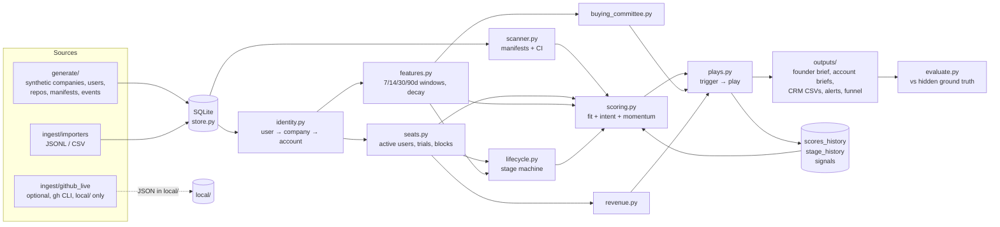
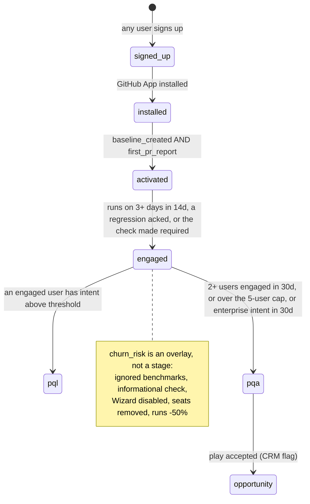
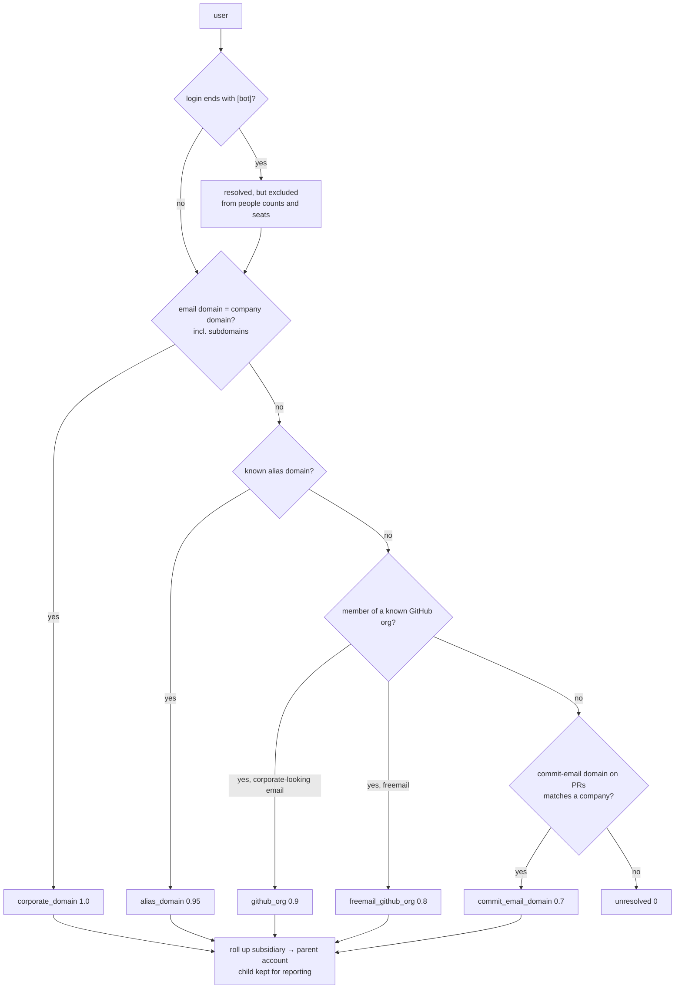

# Architecture

gtm-signal-engine is a batch pipeline. Every Monday it reads product events and market
signals, resolves who they belong to, scores each account, picks a play, and writes the
briefs a founder and a GTM engineer act on. Everything runs on the standard library and
SQLite. A fixed seed and a fixed "now" make every run reproducible.

> Independent demo. Event names, weights and thresholds are hypotheses, not CodSpeed's.

## Data flow

`pipeline.compute_week()` is pure: an in-memory `Dataset` goes in and a `WeekResult`
comes out, so benchmarks and tests never touch disk. `pipeline.run_week()` adds
persistence (scores, stages and signals keyed by week) and writes the output files.
Last week's stored scores drive week-over-week deltas, momentum and "biggest movers".
Last week's stored stages decide which PQAs are new.

## Lifecycle state machine

Each stage has entry criteria (thresholds in `config/signals.toml`) and a prerequisite.
An account enters a stage at the later of its criteria time and its prerequisite's
entry time. Every transition is stored in `stage_history` with a timestamp. A row is
written once, so the first entry is kept.

`pql` describes a person. An account "reaches" pql when it has at least one PQL user.
`pqa` and `pql` both follow `engaged`, so the funnel reports each one's conversion
from `engaged`.

## Identity resolution

The funnel report includes the unresolved rate and the "resolved by fallback" rate
(anything but corporate domain).

## Storage

| Table | Key | What |
|---|---|---|
| companies, users, repos, manifests, events | natural ids | inputs (upserted) |
| ground_truth | company_id | hidden labels; only `evaluate.py` reads them |
| opportunities | account_id, play_id | simulated "play accepted" CRM flag |
| identity | user_id, week | resolution per week |
| signals | account_id, week, kind | stage, seats, scan, plays, ARR per week |
| scores_history | account_id, week | fit, intent, priority, deltas, reasons |
| stage_history | entity_type, entity_id, stage | first time an entity entered a stage |

## Performance notes (baseline)

The baseline is written to be efficient so regressions show up clearly in CodSpeed:

* lookup dicts (domain, alias, org, account root, repo privacy) built once per run
* single time-ordered pass over events in `seats.py` and `features.py`, with repo
  enablement tracked as the stream goes
* window cutoffs and the decay rate computed once per run, never per event
* scanner regexes compiled once at module level
* `bisect` to cut events at the as-of time (no full copy or rescan)
* the rolling 30-day active-user series is built from a difference array over merged
  per-user intervals: O(activity + days), not O(users x days)
